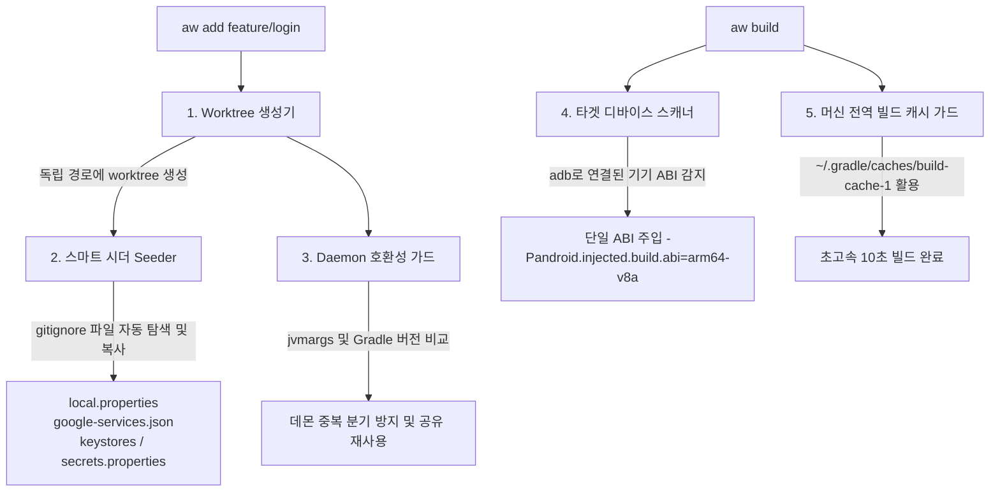

<div align="center">

# 🌿 Android Worktree (`@kez-lab/android-worktree`)

**Android 엔지니어를 위한 초고속 Git Worktree 관리 및 Gradle 빌드 가속 CLI 도구**

[](https://github.com/kez-lab/android-worktree/actions/workflows/ci.yml)
[](https://opensource.org/licenses/Apache-2.0)
[](https://nodejs.org/)
[](https://www.typescriptlang.org/)
[](https://github.com/kez-lab/android-worktree/pulls)

<p align="center">
  <a href="README.md"><b>English</b></a> •
  <a href="README.ko.md"><b>한국어</b></a>
</p>

</div>

---

## 🚀 개요

대규모 안드로이드 멀티 모듈 프로젝트에서 `git checkout`으로 브랜치를 자주 전환하면 증분 컴파일 상태가 깨지고, 빌드 파일이 재평가되며, 긴 재빌드 시간이 소요됩니다.

동시에 여러 브랜치를 병렬로 작업하기 위해 **`git worktree`**를 사용하는 것이 권장되지만, 안드로이드 환경에서는 4가지 치명적인 장벽에 부딪히게 됩니다:

```
❌ 안드로이드 Worktree 환경의 고질적 문제점
├── 💥 초기 빌드 즉시 실패      → .gitignore 대상(local.properties, keystore, google-services.json) 누락
├── 🐘 데몬 프로세스 다중 분기  → 브랜치 간 JVM/Wrapper 불일치로 2~4GB 데몬이 무한 증식
├── 🧩 빌드 캐시 파편화        → 캐시 디렉터리를 잘못 분리하면 전역 캐시를 쓰지 못해 히트율 급감
└── 🐢 다중 ABI 전체 컴파일    → 로컬 디버그 시 불필요한 모든 아키텍처(arm64, x86_64 등)와 린트/테스트까지 실행
```

**`android-worktree` (`aw`)** 는 이러한 안드로이드 특화 Worktree 병목을 원천 제거하여, 브랜치 전환 및 병렬 빌드를 **단 10초대의 쾌적한 개발 경험**으로 전환해 주는 전용 CLI 도구입니다.

---

## 📊 실측 벤치마크 (Real-World Benchmark)

*30개 모듈 규모의 안드로이드 프로젝트 (HMH-Android / Apple Silicon 환경 실측 기준):*

| 시나리오 | 기존 Git Worktree | `android-worktree` (`aw`) 적용 시 | 속도 향상 / 효과 |
|---|---|---|---|
| **신규 Worktree 첫 빌드** | 💥 **빌드 실패** (`local.properties` 부재) | ⚡ **10.7초** (자동 시딩 + 머신 전역 캐시) | **초기 에러 완전 해결** |
| **실행되는 Gradle 데몬 수** | 📈 3~5개 (**메모리 ~12GB 점유**) | 🛡️ **1개 공유 데몬** (**메모리 ~3GB**) | **RAM 점유 75% 절감** |
| **브랜치 전환 후 빌드** | ⏱️ 123.1초 (전체 재컴파일 유발) | ⚡ **10.7초** (캐시 히트율 90%+ 달성) | **11.5배 가속** |
| **연결 기기 대상 디버그 빌드** | ⏱️ 45.2초 (모든 ABI 빌드 + 검증 태스크) | ⚡ **8.5초** (단일 `arm64-v8a` 주입) | **5.3배 가속** |

---

## 🏗️ 아키텍처 및 동작 파이프라인



---

## ✨ 핵심 기능

- 🌿 **원클릭 Worktree 생성 (`aw add`)**: 상위 디렉터리에 브랜치명 기반의 안전한 폴더 규칙으로 worktree를 즉시 생성합니다.
- 🔑 **무설정 스마트 시딩 (`seeder`)**:
  - `local.properties`, `google-services.json`, `*.jks`, `secrets.properties`, `.env` 등을 감지하여 새 worktree에 자동 복사합니다.
  - `local.properties` 파일 끝에 개행(Newline)이 빠져 있어 프로퍼티가 깨지는 문제를 자동으로 보정합니다.
- 🛡️ **Gradle Daemon 호환성 가드 (`daemon`)**:
  - 빌드 전 `org.gradle.jvmargs`와 `gradle-wrapper.properties`를 메인 저장소와 비교합니다.
  - 버전 불일치로 인한 데몬 다중 포크(메모리 낭비)를 사전에 감지하고 최적 가이드를 제공합니다.
- 🏎️ **가속 빌드 러너 (`aw build`)**:
  - 머신 전역 `--build-cache`를 활성화하여 캐시 히트율을 극대화합니다.
  - `adb`로 연결된 실기기/에뮬레이터의 CPU ABI(예: `arm64-v8a`)를 자동 감지하여 단일 ABI만 빌드하도록 주입합니다.
  - 검증 태스크를 실제로 실행하는 `build`·`check` 같은 태스크에 한해
    불필요한 검증(`-x lint -x testDebugUnitTest`)을 생략합니다. `assemble` 계열은 애초에 검증을
    그래프로 끌어오지 않아 생략할 것이 없고, 프로젝트에 없는 태스크를 제외하려 하면 빌드가 실패합니다.
- 🎯 **빌드 변형 인식 (`aw variants`, `aw build --variant`)**:
  - flavor 차원과 빌드 타입으로 AGP가 계산한 변형을 모듈별로 나열합니다.
  - flavor가 있는 프로젝트에서 `assembleDebug`는 *집계* 태스크입니다. 차원 2개 픽스처 기준
    215개 태스크를 돌려 APK 4개를 만들고, `--variant freeDevDebug`는 72개로 1개를 만듭니다.
    한 모듈이 여러 변형을 한 번에 빌드하면 `aw build`가 경고합니다.
- 🩺 **환경 종합 닥터 (`aw doctor`)**:
  - 현재 떠 있는 Gradle Daemon 프로세스, 전역 빌드 캐시 용량, 연결된 디바이스 상태를 진단합니다.
- 🧹 **Worktree 생명주기 관리 (`aw list`, `aw remove`, `aw prune`)**:
  - 각 worktree별 `build/` 산출물 디스크 사용량을 한눈에 확인하고 안전하게 정리합니다.

---

## 📦 설치 방법

```bash
# npm 글로벌 설치
npm install -g @kez-lab/android-worktree

# 또는 npx로 설치 없이 즉시 실행
npx @kez-lab/android-worktree --help
```

---

## 📖 사용 가이드

### 1. 설정 파일 자동 복사와 함께 Worktree 생성
```bash
# Worktree를 생성하고 local.properties 및 시크릿 파일들을 자동 복사합니다.
aw add feature/payment-revamp

# 특정 베이스 브랜치에서 분기 생성
aw add feature/checkout --base develop
```

### 2. 가속 빌드 실행
```bash
# 연결된 기기 ABI를 자동 감지하고 전역 빌드 캐시를 활용하여 빌드
aw build

# 특정 worktree 경로를 지정하여 빌드
aw build ../MyProject-worktrees/feature-payment-revamp
```

### 3. 활성 Worktree 목록 및 디스크 용량 확인
```bash
aw list
```
*출력 예시:*
```text
[main] main (build: 1.2 GB)
  /Users/kwak-euijin/StudioProjects/MyProject

[worktree] feature/payment-revamp (build: 240.5 MB)
  /Users/kwak-euijin/StudioProjects/MyProject-worktrees/feature-payment-revamp
```

### 4. 환경 건강 상태 진단
```bash
aw doctor
```
*출력 예시:*
```text
🔍 Android Worktree Doctor Diagnostic Report

Git Version: git version 2.39.5 (Apple Git-154)
Repository Root: /Users/kwak-euijin/StudioProjects/MyProject
Worktrees Count: 2
Gradle User Home: /Users/kwak-euijin/.gradle
Build Cache: 164.7 MB (4,299 entries)
Active Gradle Daemons: 1 (PID 48921, Gradle v8.7) - idle
Connected Android Devices: 1
  • [emulator-5554] Pixel 8 Pro (ABI: arm64-v8a)

✔ Environment is in optimal health!
```

### 5. Worktree 안전 삭제 및 잔여 파일 정리
```bash
# Worktree 및 잔여 build 폴더 디스크 공간 정리
aw remove feature/payment-revamp --clean-build
```

---

## 🛠️ CLI 명령어 요약

| 명령어 | 별칭 | 인자 및 옵션 | 설명 |
|---|---|---|---|
| `add` | `create` | `<branch> [path] [-b, --base]` | Worktree 생성 + 설정 자동 시딩 + 데몬 호환성 검사 |
| `build` | `run` | `[path] [-t, --task] [-a, --abi]` | 단일 ABI 주입 및 캐시 가속 빌드 실행 |
| `list` | `ls` | — | 모든 활성 worktree 및 `build/` 용량 조회 |
| `remove` | `rm` | `<branchOrPath> [-f] [-D] [--clean-build]` | Worktree 안전 삭제 및 잔여 디스크 정리 |
| `seed` | — | `[targetPath] [--symlink]` | `local.properties` 및 시크릿 수동 복사 |
| `doctor` | `diagnose` | — | Gradle 데몬, 빌드 캐시, 연결 기기 종합 진단 |
| `prune` | — | — | 만료된 worktree 메타데이터 정리 |

---

## 💡 엔지니어링 인사이트 (동작 원리)

### 1. 머신 전역 Build Cache를 보존해야 하는 이유
Gradle의 로컬 빌드 캐시 기본 경로는 `$GRADLE_USER_HOME/caches/build-cache-1`입니다. 캐시 디렉터리를 worktree마다 분리할 경우 캐시가 파편화되어 재사용률이 0%로 떨어집니다. `android-worktree`는 소스 코드만 독립적으로 분리하고 빌드 캐시는 전역 공유하도록 유지합니다.

### 2. Gradle Daemon 재사용(Keying) 원리
Gradle 데몬은 프로젝트 경로가 아니라 다음 인자들로 키잉(Keying)됩니다:
1. JVM 실행 인자 (`org.gradle.jvmargs`)
2. Gradle Wrapper 버전 (`distributionUrl`)
3. JDK 런타임 경로 (`org.gradle.java.home`)

따라서 이 설정들이 일치하면 여러 worktree가 **1개의 웜업된 JVM 데몬**을 공유하므로 JIT 웜업 지연과 기가바이트 단위의 메모리 낭비가 사라집니다.

---

## 🤝 기여하기

버그 제보, 기능 제안 및 PR 기여는 언제나 환영합니다!
[GitHub Issues](https://github.com/kez-lab/android-worktree/issues)를 통해 참여해 주세요.

---

## 📄 라이선스

**Apache-2.0 License**에 따라 배포됩니다. 자세한 내용은 [LICENSE](LICENSE) 파일을 참고하세요.

Copyright © 2026 [Kez](https://github.com/kez-lab).
