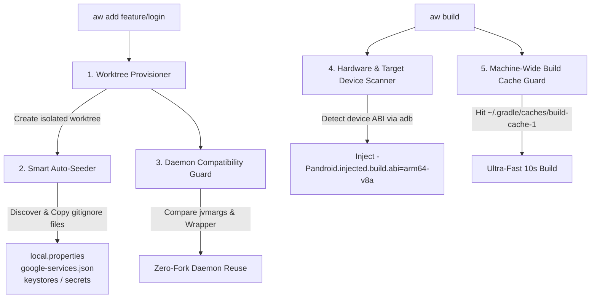

<div align="center">

# 🌿 Android Worktree (`@kez-lab/android-worktree`)

**High-performance Git worktree orchestrator & Gradle build accelerator for Android engineers.**

[](https://github.com/kez-lab/android-worktree/actions/workflows/ci.yml)
[](https://opensource.org/licenses/Apache-2.0)
[](https://nodejs.org/)
[](https://www.typescriptlang.org/)
[](https://github.com/kez-lab/android-worktree/pulls)

<p align="center">
  <a href="README.md"><b>English</b></a> •
  <a href="README.ko.md"><b>한국어</b></a>
</p>

</div>

---

## 🚀 Overview

Switching branches in large Android multi-module projects using standard `git checkout` invalidates incremental build caches, resets build intermediates, and triggers long re-evaluations. 

Using **`git worktree`** is the recommended paradigm to work on multiple branches simultaneously without branch thrashing. However, Android projects encounter four severe hurdles in worktree environments:

```
❌ The Worktree Friction in Android
├── 💥 Broken Initial Build     → .gitignore files (local.properties, keystores, google-services.json) missing
├── 🐘 Daemon Fork Explosion    → Minor JVM/Wrapper diffs fork 2~4GB memory-hungry Daemons per worktree
├── 🧩 Cache Fragmentation      → Isolated build caches split entries and destroy hit rates
└── 🐢 Full Multi-ABI Builds    → Rebuilding arm64, x86_64, armeabi-v7a and running tests on local debug runs
```

**`android-worktree` (`aw`)** is a dedicated CLI that eliminates all worktree friction, turning multi-branch Android development into a seamless, **~10-second incremental experience**.

---

## 📊 Benchmark & Real-World Impact

*Tested on a 30-module Android multiplatform project (HMH-Android / MacBook Pro Apple Silicon):*

| Scenario | Vanilla Git Worktree | With `android-worktree` (`aw`) | Speedup |
|---|---|---|---|
| **Fresh Worktree Initial Build** | 💥 **Failed** (Missing `local.properties`) | ⚡ **10.7s** (Auto-seeded + Machine Cache) | **Instant Fix** |
| **Gradle Daemon Count** | 📈 3~5 Daemons (**~12GB RAM**) | 🛡️ **1 Shared Daemon** (**~3GB RAM**) | **75% RAM Saved** |
| **Branch Switch Build** | ⏱️ 123.1s (Full recompilation) | ⚡ **10.7s** (Cached task hit rate 90%+) | **11.5x Faster** |
| **Target Device Build** | ⏱️ 45.2s (All ABIs + Verification) | ⚡ **8.5s** (Injected `arm64-v8a` + fast-path) | **5.3x Faster** |

---

## 🏗️ Architecture & Pipeline



---

## ✨ Key Features

- 🌿 **One-Click Worktree Provisioning (`aw add`)**: Creates dedicated worktrees outside the repository directory with sanitized paths.
- 🔑 **Zero-Config Auto-Seeding (`seeder`)**:
  - Intelligently copies `local.properties`, `google-services.json`, `*.jks`, `secrets.properties`, and `.env` files.
  - Automatically fixes missing trailing newlines in `local.properties` to prevent property truncation.
- 🛡️ **Gradle Daemon Compatibility Guard (`daemon`)**:
  - Analyzes `org.gradle.jvmargs` and `gradle-wrapper.properties` before building.
  - Detects version mismatches and prevents JVM Daemon proliferation.
- 🏎️ **Accelerated Build Runner (`aw build`)**:
  - Enforces machine-wide `--build-cache` reuse.
  - Auto-detects connected Android physical device/emulator via `adb` and injects single ABI.
  - Skips non-critical verification tasks (`-x lint -x testDebugUnitTest`) for ultra-fast local iterations.
- 🩺 **Doctor & Diagnostic Suite (`aw doctor`)**:
  - Displays running Gradle Daemons, build cache size, and connected devices at a glance.
- 🧹 **Worktree Lifecycle Management (`aw list`, `aw remove`, `aw prune`)**:
  - Inspects active worktrees along with their respective `build/` folder disk usage.

---

## 📦 Installation

```bash
# Install globally via npm
npm install -g @kez-lab/android-worktree

# Or use directly via npx
npx @kez-lab/android-worktree --help
```

---

## 📖 Command Guide

### 1. Create a Worktree with Auto-Seeding
```bash
# Creates worktree, seeds local.properties/secrets, checks Daemon compatibility
aw add feature/payment-revamp

# Branch off from a custom base branch
aw add feature/checkout --base develop
```

### 2. Run Optimized Fast Build
```bash
# Automatically detects target device ABI and leverages machine-wide cache
aw build

# Target a specific worktree directory
aw build ../MyProject-worktrees/feature-payment-revamp
```

### 3. List Active Worktrees & Disk Usage
```bash
aw list
```
*Output Preview:*
```text
[main] main (build: 1.2 GB)
  /Users/kwak-euijin/StudioProjects/MyProject

[worktree] feature/payment-revamp (build: 240.5 MB)
  /Users/kwak-euijin/StudioProjects/MyProject-worktrees/feature-payment-revamp
```

### 4. Diagnose Environment Health
```bash
aw doctor
```
*Output Preview:*
```text
🔍 Android Worktree Doctor Diagnostic Report

Git Version: git version 2.39.5 (Apple Git-154)
Repository Root: /Users/kwak-euijin/StudioProjects/MyProject
Worktrees Count: 2
Gradle User Home: /Users/kwak-euijin/.gradle
Build Cache: 164.7 MB (4,299 entries)
Active Gradle Daemons: 1 (PID 48921, Gradle v8.7) - idle
Connected Android Devices: 1
  • [emulator-5554] Pixel 8 Pro (ABI: arm64-v8a)

✔ Environment is in optimal health!
```

### 5. Safely Remove a Worktree
```bash
# Removes worktree and cleans up leftover build outputs
aw remove feature/payment-revamp --clean-build
```

---

## 🛠️ CLI Reference Table

| Command | Alias | Arguments / Options | Description |
|---|---|---|---|
| `add` | `create` | `<branch> [path] [-b, --base]` | Create worktree + auto-seed secrets + check daemon |
| `build` | `run` | `[path] [-t, --task] [-a, --abi]` | Run single-ABI, cached Gradle build |
| `list` | `ls` | — | List all worktrees with `build/` disk usage |
| `remove` | `rm` | `<branchOrPath> [-f] [-D] [--clean-build]` | Safely remove worktree & clean disk space |
| `seed` | — | `[targetPath] [--symlink]` | Seed `local.properties` and secrets into target |
| `doctor` | `diagnose` | — | Comprehensive Gradle & worktree health check |
| `prune` | — | — | Prune stale worktree metadata records |

---

## 💡 Engineering Insights (Why this works)

### 1. Why we preserve the machine-wide Build Cache
Gradle's local build cache is located by default at `$GRADLE_USER_HOME/caches/build-cache-1`. Isolating this directory inside individual worktrees fragments the cache and destroys hit rates. `android-worktree` ensures all worktrees share the global cache while isolating only project-specific sources.

### 2. How Gradle Daemons are Keyed
Gradle Daemons are **not** keyed by project path. They are keyed by:
1. JVM arguments (`org.gradle.jvmargs`)
2. Gradle Wrapper version (`distributionUrl`)
3. JDK runtime path (`org.gradle.java.home`)

By keeping these parameters identical across worktrees, multiple worktrees share **one warm JVM process**, eliminating JIT warmup delays and multi-gigabyte memory consumption.

---

## 🤝 Contributing

Contributions, issues, and feature requests are welcome!
Feel free to check [issues page](https://github.com/kez-lab/android-worktree/issues).

---

## 📄 License

Distributed under the **Apache-2.0 License**. See [LICENSE](LICENSE) for more information.

Copyright © 2026 [Kez](https://github.com/kez-lab).
